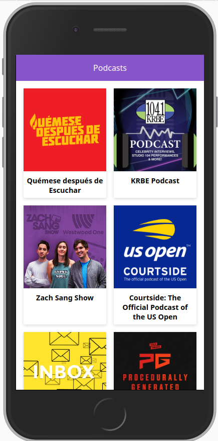

# App de Podcast de Platzi with next v9.3.5, functions and hooks"

App de Podcast integrada con API de AudioBoom. Workshop y repaso de NextJs

## ¿Cómo funciona?

Requiere Node.JS 10

* `npm install` para instalar dependencias.
* `npm run dev` para el entorno de desarollo.
* `npm run build && npm start` para el entorno de producción.

## Licencia

MIT
